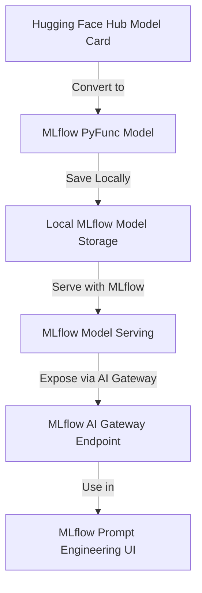

*注意書き: 本記事の執筆には誤字脱字などの文章校正以外に __生成AIを利用していません__。*

[MLflow](https://mlflow.org/)は機械学習のMLOpsのためのOSSライブラリです。最新のバージョンでは、LLMに関する実験管理の機能が随時開発・リリースされています。今回はその中でもPrompt Engineering UIを使って、非サポートのローカルLLMを利用する方法を紹介します。

## MLflow Prompt Enginnering UIとは？
[MLflow Prompt Enginnering UI](https://mlflow.org/docs/latest/llms/prompt-engineering/index.html)は、ノーコードで様々なモデルのプロンプトチューニングを行い、それらをUI上で簡単に比較することができる機能です。Prompt Engineering UIを利用することで、モデルのプロンプトを最適化するための実験を簡単に行うことができます。


*MLflow Prompt Engineering UIの操作画面*

このPrompt Enginnering UIを利用するためには、[MLflow AI Gateway](https://mlflow.org/docs/latest/llms/deployments/index.html#providers)からモデルの推論エンドポイントを作成する必要があります。[OpenAI](https://openai.com/ja-JP/)などの主要な生成AIモデルは公式にサポートされており、[OpenAI API Key](https://openai.com/index/openai-api/)とyamlファイルを設定するだけで、簡単に利用することができます。


*MLflow AI Gatewayが公式にサポートしているプロバイダー*

今回はそれらの公式サポートモデルではない、[LLM-jp](https://llm-jp.nii.ac.jp/)などのローカルモデルを用いてMLflow Prompt Enginnering UIを利用する方法を紹介します。

## Prompt Enginnering UIで非サポートのローカルLLMを利用する
MLflow Prompt Engineering UIを利用して、Huggingfaceモデルのプロンプトチューニングを行う方法は主に2つあります。

1. [Huggingface Text Generation Interface (TGI)](https://huggingface.co/docs/text-generation-inference/index)


*Huggingface TGIの概要*

Huggingface TGIは、Rust/Python/gRPCサーバーから構成されるテキスト生成ツールキットです。2025年2月現在では、`Llama`や`Phi 3`, `Deepseek V3`などのオープンソースLLMをサポートしています([サポートされているモデルリスト](https://huggingface.co/docs/text-generation-inference/supported_models))。

:::message

サポートされていないモデルも利用可能ですが、パフォーマンスは保証されていないようです。

> If the above list lacks the model you would like to serve, depending on the model’s pipeline type, you can try to initialize and serve the model anyways to see how well it performs, but performance isn’t guaranteed for non-optimized models

:::

また公式Dockerコンテナが公開されており、以下のように利用できます ([Quick Tour](https://huggingface.co/docs/text-generation-inference/quicktour))。NVIDIA GPUを利用する場合には[NVIDIA Container Toolkit](https://docs.nvidia.com/datacenter/cloud-native/container-toolkit/latest/install-guide.html)のインストールが必要です。また、CUDA 12.2以上が推奨されています。

```bash
model=teknium/OpenHermes-2.5-Mistral-7B
volume=$PWD/data # share a volume with the Docker container to avoid downloading weights every run

docker run --gpus all --shm-size 1g -p 8080:80 -v $volume:/data \
    ghcr.io/huggingface/text-generation-inference:3.1.0 \
    --model-id $model
```

[公式リポジトリ](https://github.com/huggingface/text-generation-inference)からローカルビルドも可能ですが、Dockerを利用することが強く推奨されているようです。著者もローカルビルドを試みましたが、ビルドエラーが発生しました。

TGIのリソース要件を満たす場合には、こちらで推論エンドポイントを作成することができます。Dockerが利用できない環境や、mlflowライブラリに統一したい場合には、次に紹介する方法も利用可能です。


2. [MLflow Model Serving](https://mlflow.org/docs/latest/deployment/deploy-model-locally.html)

Huggingface TGIを利用できない場合は、Huggingfaceモデルを[pyfunc.PythonMode](https://mlflow.org/docs/latest/python_api/mlflow.pyfunc.html)でラップし、MLflow Model Servingを利用して推論エンドポイントを作成します。

全体の流れは次のとおりです。


今回は[LLM-jp-3-3.7b-instruct](https://huggingface.co/llm-jp/llm-jp-3-3.7b-instruct)を使用してみます。まず、huggingfaceからロードしたモデルを、`pyfunc.PythonModel`でラップし、ローカルに保存します。

```python
import torch
import mlflow.pyfunc
from transformers import AutoModelForCausalLM, AutoTokenizer


class HFTextGenModel(mlflow.pyfunc.PythonModel):
    def __init__(self, model_repo=None):
        self.model_repo = model_repo
        self.model = None
        self.tokenizer = None

    def load_context(self, context):
        device = torch.device("cuda" if torch.cuda.is_available() else "cpu")
        self.model = AutoModelForCausalLM.from_pretrained(self.model_repo).to(device)
        self.tokenizer = AutoTokenizer.from_pretrained(self.model_repo)

    def predict(self, context, model_input):
        prompts = self.tokenizer.apply_chat_template(model_input, tokenize=False)
        inputs = self.tokenizer(prompts, return_tensors="pt").to(self.model.device)

        with torch.inference_mode():
            output_ids = self.model.generate(
                inputs.input_ids,
                max_new_tokens=100,
                do_sample=True,
                top_p=0.95,
                temperature=0.7,
                repetition_penalty=1.05,
            )[0]

        generated_text = self.tokenizer.decode(output_ids, skip_special_tokens=True)

        return ["".join(generated_text)]


if __name__ == "__main__":
    save_dir = "./saved_model"
    model_repo = "llm-jp/llm-jp-3-3.7b-instruct"

    mlflow.pyfunc.save_model(
        path=save_dir,
        python_model=HFTextGenModel(model_repo),
        conda_env=None,
    )

```

続いてyamlファイルに推論エンドポイントの設定ファイルを記述します。比較用としてOpenAIのチャットモデル(gpt-4, gpt-4o-mini)を追加しています。
ここでproviderにmlflow-model-servingを指定し、model_server_urlにローカルのモデルサーバーのURLを指定します。またnameには、任意のモデル名を記述します。この指定がないとエラーが発生するので注意してください。

```yaml
endpoints:
    # OpenAI Chat
    - name: chat
    endpoint_type: llm/v1/chat
    model:
        provider: openai
        name: gpt-4
        config:
            openai_api_key: $OPENAI_API_KEY

    - name: chat_3.5
    endpoint_type: llm/v1/chat
    model:
        provider: openai
        name: gpt-4o-mini
        config:
            openai_api_key: $OPENAI_API_KEY


    # LLM-jp (Huggingface) 
    - name: llm-jp-3
    endpoint_type: llm/v1/chat
    model:
        provider: mlflow-model-serving
        name: llm-jp-3-3.7b-instruct
        config:
            model_server_url: "http://localhost:5001"
```

最後に、以下のコマンドを実行してMLflow Model ServingとMLflow AI Gatewayを起動します。`MLFLOW_DEPLOYMENTS_TARGET`には、MLflow AI GatewayのURLを指定します。もしOpenAIモデルを利用する場合は、`OPENAI_API_KEY`にAPIキーを設定してください。


- MLflow Model Serving
```bash
mlflow models serve -m ./saved_model --no-conda --port 5001
```

- MLflow AI Gateway
```bash
export OPENAI_API_KEY="xxxxxxx" # if you use OpenAI Model
mlflow gateway start --config-path config.yaml --port 7000
```

- MLflow UI
```bash
export MLFLOW_DEPLOYMENTS_TARGET="http://127.0.0.1:7000"
mlflow server --port 5000 
```

ここまでの準備ができたら、ブラウザで`http://localhost:5000`にアクセスしてMLflow UIを開き、Prompt Engineering UIを利用することができます。

## LLM-jpでPrompt Engineering UIを利用してみる

こちらがPrompt Engineering UIの画面です。ここまで来れば、ノーコードで複数のモデルとプロンプトの組み合わせを検証し、その記録を保存することができます。


### 実際に試してみる
まずExperimentsを作成します。次に、右上に表示されている`+ New run`をクリックします。
すると、`using Prompt Engineering (Experimental)`と`using Notebook`の2つの選択肢が表示されます。今回は`using Prompt Engineering (Experimental)`を選択します。


*新しいRunを作成する*

次に以下のような画面が表示されます。


*Prompt Engineering UIの画面*

正しく推論エンドポイントが認識されていれば、画面左上の`served LLM model`のトグルを開くと、yamlファイルで指定したモデルが表示されます。今回は`llm-jp-3-3.7b-instruct`を選択しておきます。


*推論エンドポイントの選択*

次にプロンプトを入力します。Prompt Templateでは`{{}}`を使用して変数を指定することができます。今回は`{{object}}`は何色ですか？というプロンプトテンプレートを作成し、`object`に`りんご`を指定して、evaluateボタンをクリックします。
するとOutputフィールドに生成された文章が表示されます。今回生成された文章が、返答としておかしいように見えますが、その原因は後ほど説明します。
(`llm-jp-3.7b-instruct`に同じプロンプトを別途与えると、きちんとりんごが赤色であるという旨の出力をするので、MLflowの入力に問題がある可能性が高いです。)


*日本語プロンプトを入力してみる*

右下の`create run`ボタンをクリックすると、プロンプトの評価結果が保存されます。保存された結果は、Experimentsの`Evaluation (Experimental)`タブで確認することができます。
ここでは、複数のプロンプトとモデルを比較することができます。


*複数のモデルとプロンプトを比較する*


### 問題点
プロンプトを日本語で入力すると、内部で文字化けしてしまうようです。[こちら](https://qiita.com/isanakamishiro2/items/184f7ee8a1d00cc01fea)の記事でもMLflowの文字化けが報告されています。


*日本語プロンプトの文字化け*


*英語プロンプト (stock_type template)*

画像ではOpenAIモデルの出力は正常ですが、文字化けしたプロンプトが渡されています。これらのモデルではプロンプトが文字化けしていても、元のプロンプト文章を復元できるようです。

:::message

MLflow公式リポジトリにIssueを報告しています。

:::

## 参考資料

- [LLM-jp](https://llm-jp.nii.ac.jp/)
- [MLflow Prompt Enginnering UI](https://mlflow.org/docs/latest/llms/prompt-engineering/index.html)
- [MLflow Model Serving](https://mlflow.org/docs/latest/deployment/deploy-model-locally.html)
- [MLflow AI Gateway](https://mlflow.org/docs/latest/llms/deployments/index.html#providers)
- [Huggingface Text Generation Interface (TGI)](https://huggingface.co/docs/text-generation-inference/index)

